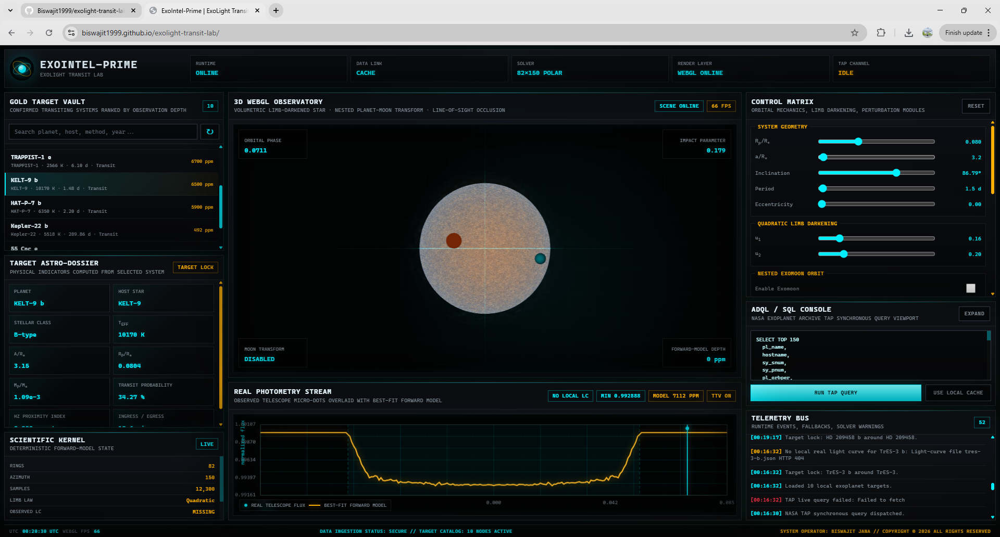

# ExoIntel-Prime  
### Interactive Exoplanet Transit Photometry Laboratory

🌐 **Live website:** [Open ExoIntel-Prime](https://biswajit1999.github.io/exolight-transit-lab/)



**ExoIntel-Prime** is a browser-based exoplanet transit photometry laboratory designed for scientific visualisation, education, and research communication. It compares locally cached archival light curves with a worker-computed theoretical transit model and renders the corresponding star–planet system in a cinematic WebGL scene.

The project runs directly on GitHub Pages using plain HTML, CSS, and JavaScript ES modules. There is no React, Vite, npm, build step, or server dependency required for the public website.

---

## Purpose

A planetary transit occurs when an exoplanet passes in front of its host star from the observer’s line of sight. The star’s brightness drops by a small amount, and the shape of that dip contains information about the planet radius, orbital inclination, scaled orbital distance, stellar limb darkening, and possible additional effects such as starspots or moon-like occultors.

ExoIntel-Prime is built to make that connection visible:

- the **points** show archival or locally processed photometry;
- the **curve** shows the theoretical browser-computed model;
- the **3D scene** shows the corresponding star–planet geometry;
- the **scientific readout** explains the model diagnostics in plain language.

This is not just a decorative website. The model curve is computed from a physical forward model in a Web Worker, while the interface remains responsive.

---

## Current public version

The current version includes:

- worker-backed transit modelling;
- quadratic limb darkening;
- finite exposure-time integration;
- circular and approximate eccentric projected geometry;
- optional starspot morphology;
- optional exomoon hypothesis mode;
- live residual and out-of-transit diagnostics;
- animated WebGL stellar rendering;
- temperature-based stellar colour;
- light and night mode;
- cinematic 0–100% loading sequence;
- static GitHub Pages deployment.

---

## Scientific model

### Transit depth

For a small planet crossing a uniform stellar disk, the approximate transit depth is

```text
δ ≈ (Rp / R★)^2
````

where:

* `Rp` is the planetary radius;
* `R★` is the stellar radius;
* `Rp/R★` is the radius ratio.

ExoIntel-Prime displays the model depth both as a percentage and in parts per million:

```text
10,000 ppm = 1%
```

This makes the result easier for general users while preserving the standard photometric unit used in exoplanet studies.

---

### Limb darkening

The model uses the quadratic limb-darkening law:

```text
I(μ) = 1 - u1(1 - μ) - u2(1 - μ)^2
```

where:

```text
μ = cos(θ)
```

The sliders `u1` and `u2` control the stellar centre-to-limb brightness profile. Changing these values affects the ingress, egress, and transit-bottom shape.

---

### Numerical disk integration

The stellar disk is sampled numerically. Each visible surface sample has a position and intensity weight. At each orbital phase, the worker checks which samples are blocked by the planet and optional moon-like body.

Conceptually:

```text
F(phase) = 1 - blocked stellar intensity / total stellar intensity
```

This allows the same browser model to handle:

* limb-darkened transits;
* starspot-modified intensity maps;
* planet + moon occultation geometry;
* finite exposure integration.

---

### Finite exposure integration

Real telescopes do not measure instantaneous brightness. They integrate light over a finite exposure time. ExoIntel-Prime approximates this by averaging multiple sub-samples across each model phase point.

This helps avoid unrealistically sharp ingress and egress features, especially for long-cadence or binned photometry.

---

### Eccentric geometry

The worker supports catalogue eccentricity and argument of periastron where available. The eccentric geometry is an interactive projected-orbit approximation, useful for visual and educational exploration.

It should not be interpreted as a complete eccentric-orbit fitting engine.

---

## Interface overview

### Target archive

The left panel lists targets from:

```text
data/exoplanets.json
```

Targets with local photometry are marked as observed. Targets without local photometry can use a synthetic demonstration fallback.

Visitors cannot directly modify the live production archive. To test custom data, fork the repository and add your own JSON files.

---

### Scientific readout

The readout panel includes:

* **Brightness dip** — modelled transit depth in percent and ppm;
* **Radius proxy** — approximate `sqrt(depth)` estimate of `Rp/R★`;
* **Depth contrast** — model depth divided by out-of-transit scatter;
* **Residual RMS** — data minus model scatter;
* **OOT RMS** — out-of-transit scatter;
* **Moon signal** — optional hypothesis contribution;
* **Spot boost** — starspot-crossing anomaly estimate;
* **Planet parameters** — period, duration, depth, inclination, eccentricity, radius, mass;
* **Host star parameters** — effective temperature, radius, mass, metallicity where available.

Small question-mark icons explain scientific terms for non-specialist users.

---

### WebGL model viewport

The main viewport renders a cinematic theoretical model of the selected system. The star colour is tied to the catalogue effective temperature `st_teff` where available.

The scene includes:

* animated stellar photosphere;
* procedural granulation;
* limb-darkened stellar disk;
* soft coronal glow;
* shaded planet and moon bodies;
* optional starspot visualisation;
* target-dependent stellar colour.

The visual scene is designed for intuition and communication. The plotted model curve still comes from the worker physics engine.

---

### Model controls

The right panel provides live “what-if” controls:

| Group               | Controls                                            |
| ------------------- | --------------------------------------------------- |
| Rendering           | Visual quality: Low, Balanced, Ultra                |
| Planet and orbit    | Radius ratio, scaled distance, inclination          |
| Stellar atmosphere  | Quadratic limb-darkening coefficients `u1`, `u2`    |
| Starspot morphology | Enable spot, position, radius, contrast             |
| Exomoon hypothesis  | Enable moon, moon radius, moon distance, moon phase |
| Model alignment     | Phase shift                                         |

The catalogue eccentricity and argument of periastron are passed to the worker when available, but are kept read-only in the public interface to avoid unphysical manual combinations.

---

## Important scientific caution

ExoIntel-Prime is an interactive scientific visualisation and education tool. It is not yet a formal professional fitting pipeline.

A good visual match does **not** prove:

* an exomoon;
* a starspot;
* a unique orbital solution;
* a validated planet parameter set;
* a detection claim.

Formal analysis would require additional steps such as:

* uncertainty-weighted fitting;
* detrending and systematics modelling;
* dilution/blending treatment;
* parameter priors;
* posterior inference;
* model comparison;
* validation against established modelling tools.

The exomoon and starspot modes are hypothesis demonstrations only.

---

## Repository structure

```text
exolight-transit-lab/
├── index.html
├── styles.css
├── README.md
│
├── src/
│   ├── app.js
│   ├── scene.js
│   └── transitWorker.js
│
├── data/
│   ├── exoplanets.json
│   └── lightcurves/
│
├── assets/
│   └── exointel-prime-dashboard.png
│
└── docs/
    ├── ExoIntel_Prime_User_Guide.tex
    └── ExoIntel_Prime_User_Guide.pdf
```

---

## Main files

### `index.html`

The entry file. It contains:

* metadata;
* SEO/Open Graph tags;
* loading screen markup;
* stylesheet link;
* module script entry.

---

### `styles.css`

Global page styling. It controls:

* boot screen;
* loading progress bar;
* no-script fallback;
* scrollbars;
* base typography;
* accessibility focus states.

Most of the full dashboard UI styling is injected by `src/app.js`.

---

### `src/app.js`

The main browser orchestrator. It handles:

* cinematic boot sequence;
* target archive loading;
* interface rendering;
* theme switching;
* canvas plot drawing;
* control events;
* worker communication;
* revision tracking;
* stale worker-result rejection.

---

### `src/transitWorker.js`

The physics worker. It handles:

* numerical light-curve generation;
* finite exposure integration;
* circular/eccentric projected geometry;
* limb-darkened disk sampling;
* starspot intensity modification;
* optional exomoon occultation;
* residual and OOT diagnostics;
* latest-state mailbox execution.

---

### `src/scene.js`

The WebGL scene renderer. It handles:

* animated star rendering;
* stellar temperature colour mapping;
* procedural photospheric texture;
* planet and moon visualisation;
* visual quality modes;
* synchronisation with the current target and model state.

---

## Running locally

Because the project uses JavaScript ES modules, open it through a local server rather than double-clicking `index.html`.

From the repository root:

```bash
python -m http.server 8000
```

Then open:

```text
http://localhost:8000
```

---

## Deploying to GitHub Pages

Use GitHub Pages with:

```text
Source: Deploy from a branch
Branch: main
Folder: /root
```

The app works from the repository root because `index.html` is already at the top level.

After pushing updates, GitHub Pages can take a short time to refresh. If the website still shows the old version, open the page and press:

```text
Ctrl + F5
```

or test with a cache-busting URL:

```text
https://biswajit1999.github.io/exolight-transit-lab/?v=latest
```

---

## Adding custom targets

To add your own target, fork the repository and edit:

```text
data/exoplanets.json
```

Example target entry:

```json
{
  "pl_name": "HD 189733 b",
  "hostname": "HD 189733",
  "discoverymethod": "Transit",
  "disc_year": 2005,

  "pl_orbper": 2.21857567,
  "pl_ratror": 0.15534,
  "pl_trandep": 24000,
  "pl_trandur": 1.823,
  "pl_orbincl": 85.71,
  "pl_orbeccen": 0.0,
  "pl_orblper": 90.0,

  "pl_rade": 12.7,
  "pl_bmasse": 363.0,

  "st_teff": 5052,
  "st_rad": 0.75,
  "st_mass": 0.79,
  "st_logg": 4.55,
  "st_met": -0.03,

  "lightcurve_file": "hd-189733-b.json",
  "lightcurve_available": true
}
```

---

## Adding custom light curves

Add the light curve file under:

```text
data/lightcurves/
```

Example array format:

```json
{
  "source": "local processed light curve",
  "phase": [-0.050, -0.049, -0.048],
  "flux": [1.0002, 0.9999, 1.0001],
  "error": [0.0004, 0.0004, 0.0004]
}
```

Example point-list format:

```json
{
  "source": "local processed light curve",
  "points": [
    { "phase": -0.050, "flux": 1.0002, "error": 0.0004 },
    { "phase": -0.049, "flux": 0.9999, "error": 0.0004 }
  ]
}
```

Flux should be normalised so the out-of-transit baseline is close to 1.

---

## Recommended preprocessing

Before adding a custom light curve:

1. remove NaN and infinite values;
2. normalise the out-of-transit flux baseline near 1;
3. convert time to orbital phase;
4. remove or flag severe outliers;
5. keep the file small enough for browser loading;
6. record provenance in the `source` field.

---

## Performance notes

The site includes high-quality WebGL rendering and numerical transit calculations. For normal use:

* use **Balanced** visual quality;
* use **Ultra** for screenshots, videos, and demonstrations;
* use **High-accuracy model** only after selecting a target and approximate parameters;
* use **Low** if the browser becomes slow or the device is on battery power.

The visual quality selector changes the 3D rendering only. It does not change the worker physics calculation.

---

## Hardware advisory

ExoIntel-Prime uses browser-based WebGL rendering and worker-side numerical modelling. Most modern laptops and desktops should run the site normally in Balanced mode.

However, Ultra visual quality and high-accuracy model mode can increase CPU/GPU usage. On older or low-power devices, this may cause:

* reduced frame rate;
* increased fan noise;
* higher battery use;
* browser tab slowdown.

If this happens, switch to Balanced or Low visual quality.

---

## Development notes

This project intentionally avoids build tools so that it remains transparent and easy to deploy.

Current design principles:

* no React;
* no npm dependency chain;
* no bundler;
* no external runtime libraries;
* static-first architecture;
* browser-native ES modules;
* physics isolated in a Web Worker;
* rendering separated from model computation;
* clear distinction between archival data and theoretical model.

---

## Roadmap

Planned future upgrades include:

* validation against standard transit modelling packages;
* analytic Mandel–Agol model option;
* Kipping `q1`, `q2` limb-darkening parameterisation;
* visible finite-exposure controls;
* uncertainty-weighted residuals;
* automatic phase alignment;
* dilution and third-light terms;
* CSV upload support;
* MAST/TESS/Kepler ingestion pipeline;
* multi-transit stacking;
* optimiser mode for best-fit parameters;
* model comparison between planet-only, starspot, exomoon-like, and binary-like hypotheses;
* downloadable scientific report and usage guide from the website.

---

## Author

**Biswajit Jana**
© 2026

---

## Licence and reuse

This repository is intended as a scientific visualisation and educational research-communication project. If you reuse or modify the code, please keep appropriate attribution to the original author.

For custom data experiments, fork the repository rather than modifying the live deployment directly.

```
```
